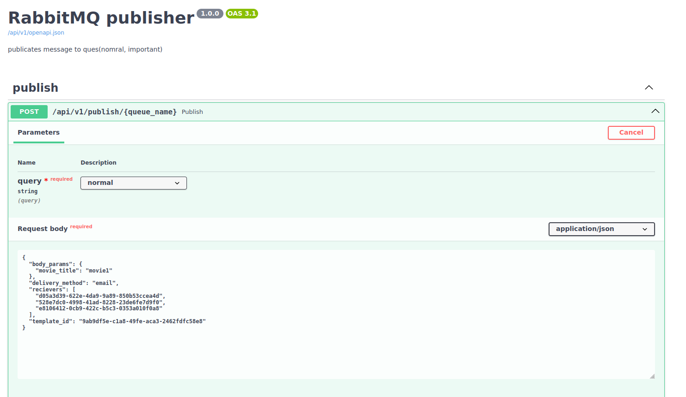

# Спринт 10. Сервис нотификации. Публикация сообщений.

## Цель:
реализовать публикацию сообщений для нотификации пользователей в очередь RabbitMQ

## Структура проекта:

```
.
├── docker-compose.dev.yml
├── docker-compose.prod.yml
├── docker-entrypoint.sh
├── Dockerfile.dev
├── Dockerfile.prod
├── main.py
├── Makefile
├── nginx
│   └── etc
│       └── nginx
│           ├── conf.d
│           │   └── default.conf.tmp
│           └── nginx.conf
├── publisher
│   ├── app.py
│   ├── __init__.py
│   ├── src
│   │   ├── api
│   │   │   └── v1
│   │   │       ├── dtos
│   │   │       │   └── publisher.py
│   │   │       └── publisher.py
│   │   ├── core
│   │   │   ├── config.py
│   │   │   ├── configs
│   │   │   │   ├── app.py
│   │   │   │   ├── docker.py
│   │   │   │   ├── __init__.py
│   │   │   │   └── rabbitmq.py
│   │   │   ├── __init__.py
│   │   │   └── logger.py
│   │   ├── databases
│   │   │   └── rabbitmq.py
│   │   ├── interfaces
│   │   │   ├── repository.py
│   │   │   └── service.py
│   │   ├── repositories
│   │   │   └── rabbitmq.py
│   │   └── services
│   │       └── publisher.py
│   └── utils
│       └── uuid.py
├── poetry.lock
├── pyproject.toml
├── README.md
└── tests
    ├── functional
    │   └── test_publisher.py
    ├── __init__.py
    └── unit
        └── test_publisher.py
```

## Инструкция по развертыванию:
в [Makefile](Makefile) указаны команды взаимодействия с сервисом

|команда|описание|
|---|---|
|init|инициализация пакета [poetry](https://python-poetry.org/)|
|lint-fix|правка стиля кода|
|lint|проверка стиля кода|
|docker-tests|запуск тестов|
|tests-cov|отчет о покрытии кода тестами|
|docker-up-build-dev|запуск сервиса в режиме разработки|
|docker-up-build-prod|запуск сервиса в режиме деплоя|
|docker-down|остановка сервиса|
|docker-prune|очистка docker контейнеров и вольюмов|

## Пример документации:
